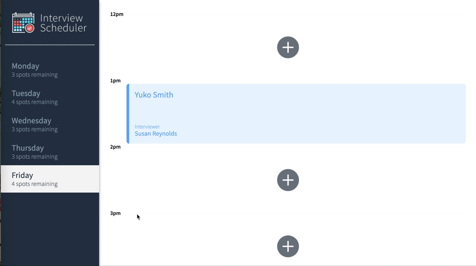

# Interview Scheduler
Interview Scheduler is a single-page application (SPA) that allows users to book technical interviews between students and mentors.

In this project, i learned to:
- Use React to create a single page application (SPA) called Interview Scheduler.
- Have the client application communicate with an API server over HTTP, using Axios to make calls to the API.
- Gain experience with different development environments, including Storybook, Jest, and Webpack Dev Server.

## Example



## Setup

Install dependencies with `npm install`.

## Running Webpack Development Server

```sh
npm start
```

## Running Jest Test Framework

```sh
npm test
```

## Running Storybook Visual Testbed

```sh
npm run storybook
```

## Running Scheduler-API

```sh
- git clone git@github.com:lighthouse-labs/scheduler-api.git
- Follow instructions on the scheduler-api repo
- cd into scheduler-api & npm start
- To test errors, run npm run error
```

## Dependencies

- "axios": "^0.18.1"
- "classnames": "^2.2.6"
- "fsevents": "^2.3.2"
- "normalize.css": "^8.0.1"
- "react": "^16.9.0"
- "react-dom": "^16.9.0"
- "react-scripts": "3.0.0"
